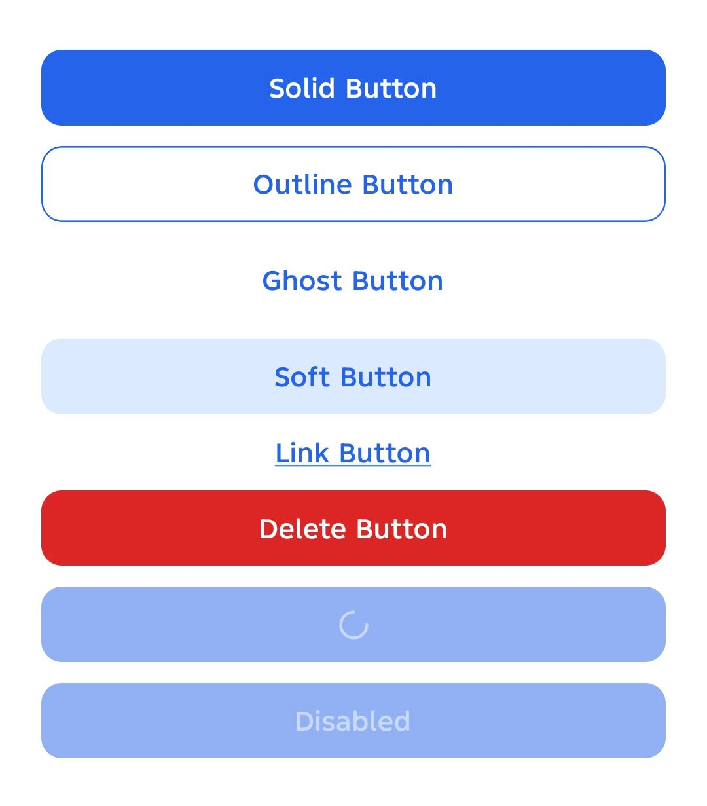
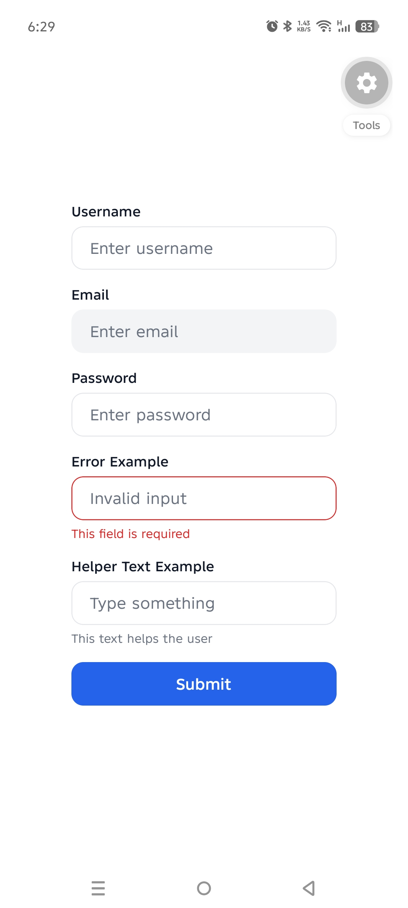

# PixelRN UI

A modern, lightweight, and customizable React Native UI library built for React Native and Expo applications.

PixelRN UI provides beautiful, production-ready components inspired by the best design patterns from modern UI libraries such as MUI, Chakra UI, Mantine, Ant Design, and shadcn/ui—while remaining fully native to React Native.

## Features

- 🚀 React Native First
- ⚡ Expo Compatible
- 🎨 Modern Design System
- 📝 TypeScript Support
- 🌙 Theme Ready
- 📱 Cross Platform (iOS & Android)
- 🪶 Lightweight & Performant
- 🧩 Modular Components

## Preview

## Button Variants




## Installation

### npm

```bash
npm install @pixelrn/ui
```

### yarn

```bash
yarn add @pixelrn/ui
```

## Current Components

### Button

Supported variants:

- solid
- outline
- ghost
- soft
- link
- destructive

Supported sizes:

- sm
- md
- lg

### Input

Supported variants:

- outline
- filled
- ghost

## Usage

```tsx
import React from "react";
import { View } from "react-native";
import { Button } from "@pixelrn/ui";

export default function App() {
  return (
    <View style={{ padding: 20, gap: 12 }}>
      <Button>Solid Button</Button>

      <Button variant="outline">Outline Button</Button>

      <Button variant="ghost">Ghost Button</Button>

      <Button variant="soft">Soft Button</Button>

      <Button variant="link">Link Button</Button>

      <Button variant="destructive">Delete Account</Button>

      <Input label="Email" placeholder="Enter email" />

      <Input
        label="Password"
        placeholder="Enter password"
        variant="outline"
        secureTextEntry
      />

      <Input
        label="Error Example"
        placeholder="Invalid input"
        error="This field is required"
      />

      <Input
        label="Helper Text Example"
        placeholder="Type something"
        helperText="This text helps the user"
      />
    </View>
  );
}
```

## Button Variants

### Solid

Primary action button.

```tsx
<Button variant="solid">Save Changes</Button>
```

### Outline

Secondary action button.

```tsx
<Button variant="outline">Save Changes</Button>
```

### Ghost

Minimal button without background or border.

```tsx
<Button variant="ghost">View Details</Button>
```

### Soft

Subtle background with primary-colored text.

```tsx
<Button variant="soft">Continue</Button>
```

### Link

Text-only action.

```tsx
<Button variant="link">Forgot Password?</Button>
```

### Destructive

Dangerous actions.

```tsx
<Button variant="destructive">Delete Account</Button>
```

## Button Sizes

```tsx
<Button size="sm">
  Small
</Button>

<Button size="md">
  Medium
</Button>

<Button size="lg">
  Large
</Button>
```

## Roadmap

### v0.1.0-alpha.1

- ✅ Button Component
- ✅ Variant Support
- ✅ Size Support
- ✅ Loading State
- ✅ Disabled State
- ✅ TypeScript Support
- ✅ Expo Support

### v0.2.0

- Input
- Card
- Badge
- Avatar
- Divider

### v0.3.0

- Modal
- Alert Dialog
- Toast
- Accordion
- Tabs

### v0.4.0

- Bottom Sheet
- Dropdown
- Select
- Multi Select
- Command Menu

## Contributing

Contributions, bug reports, feature requests, and suggestions are welcome.

### Before Starting Any Work

If you discover a bug, have an improvement idea, or want to propose a new feature:

1. Open a GitHub Issue describing the problem, suggestion, or enhancement.
2. Wait for discussion and approval from the maintainers.
3. Once the issue is approved and assigned, you may start working on it.
4. Submit a Pull Request referencing the related issue.

Please do not start development before opening an issue and receiving approval.

### Contribution Process

1. Fork the repository.
2. Create a new branch from `main`.

```bash
git checkout -b feature/your-feature-name
```

3. Make your changes.

4. Test your changes thoroughly.

5. Commit your changes.

```bash
git commit -m "feat: add new feature"
```

6. Push your branch.

```bash
git push origin feature/your-feature-name
```

7. Open a Pull Request and link the related GitHub Issue.

## Reporting Bugs

Please include:

- React Native version
- Expo version
- Device/Platform
- Steps to reproduce
- Expected behavior
- Actual behavior
- Screenshots (if applicable)

## License

MIT License © Abbas Ali Akhtar
